# AiDE Agent Web Plugin - Phase 1 Architecture Design

## Executive Summary

This document outlines the comprehensive architecture for a web browser plugin that integrates with the AiDE Agent VS Code extension. The plugin will extend AI-powered development capabilities from the VS Code environment to web browsers, enabling seamless AI-assisted development workflows across different contexts.

## 1. Architecture Overview

### 1.1 High-Level Architecture

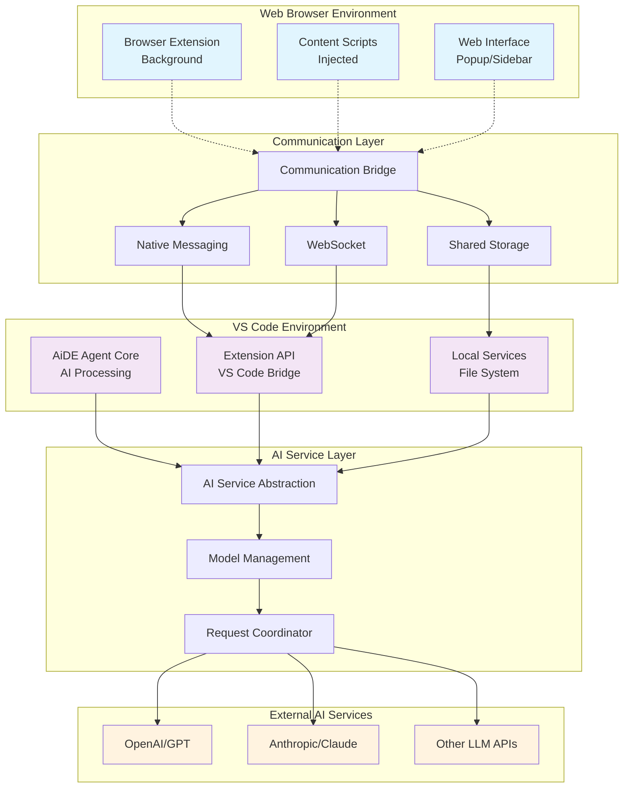

### 1.2 Core Components

1. **Browser Extension Framework**
2. **Communication Bridge**
3. **AI Integration Layer**
4. **Content Analysis Engine**
5. **Code Generation & Manipulation Engine**
6. **Session Management System**
7. **Security & Authentication Layer**
8. **Plugin Interface & UI**

#### 1.2.1 Component Interaction Diagram

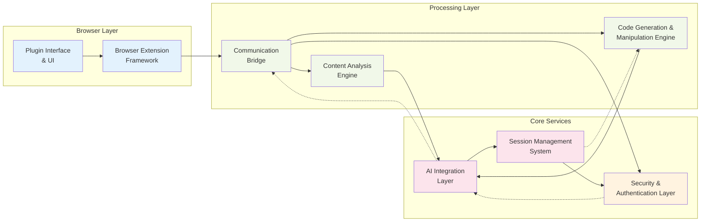

## 2. Detailed Component Architecture

### 2.1 Browser Extension Framework

#### 2.1.1 Manifest and Core Structure
```json
{
  "manifest_version": 3,
  "name": "AiDE Agent Web Plugin",
  "permissions": [
    "activeTab",
    "storage",
    "nativeMessaging",
    "clipboardRead",
    "clipboardWrite"
  ],
  "background": {
    "service_worker": "background.js"
  },
  "content_scripts": [
    {
      "matches": ["<all_urls>"],
      "js": ["content.js"]
    }
  ]
}
```

#### 2.1.2 Component Structure
```
extension/
├── manifest.json
├── background/
│   ├── service-worker.js         # Main background process
│   ├── communication-manager.js  # Bridge communication
│   ├── session-manager.js        # Session handling
│   └── ai-service-proxy.js       # AI service interactions
├── content/
│   ├── content-script.js         # Page interaction
│   ├── dom-analyzer.js           # DOM analysis
│   ├── code-detector.js          # Code detection
│   └── ui-injector.js            # UI injection
├── popup/
│   ├── popup.html               # Main popup interface
│   ├── popup.js                 # Popup logic
│   └── popup.css                # Styling
├── sidebar/
│   ├── sidebar.html             # Sidebar interface
│   ├── sidebar.js               # Sidebar logic
│   └── sidebar.css              # Sidebar styling
└── shared/
    ├── utils.js                 # Shared utilities
    ├── constants.js             # Constants
    └── types.js                 # Type definitions
```

### 2.2 Communication Bridge

#### 2.2.1 Native Messaging Protocol
```javascript
// Bridge Protocol Definition
interface BridgeMessage {
  id: string;
  type: 'request' | 'response' | 'event';
  action: string;
  payload: any;
  timestamp: number;
  source: 'browser' | 'vscode';
}

// Message Types
enum MessageTypes {
  GET_PROJECT_CONTEXT = 'get_project_context',
  EXECUTE_AI_COMMAND = 'execute_ai_command',
  GET_FILE_CONTENT = 'get_file_content',
  UPDATE_CODE = 'update_code',
  SYNC_SESSION = 'sync_session'
}
```

#### 2.2.2 Communication Channels
1. **Native Messaging**: Direct communication with VS Code extension
2. **WebSocket**: Real-time bidirectional communication
3. **Shared Storage**: Synchronized data storage
4. **IPC Events**: Inter-process communication

#### 2.2.3 Communication Flow Diagram

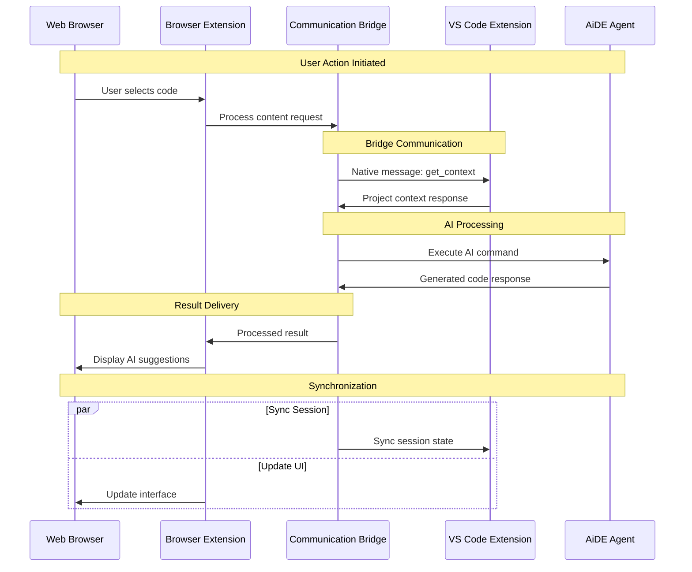

### 2.3 AI Integration Layer

#### 2.3.1 AI Service Abstraction
```typescript
interface AIService {
  name: string;
  model: string;
  apiKey: string;
  
  generateCode(prompt: string, context: CodeContext): Promise<CodeGeneration>;
  analyzeContent(content: string, type: ContentType): Promise<Analysis>;
  provideSuggestions(context: Context): Promise<Suggestion[]>;
  explainCode(code: string, language: string): Promise<Explanation>;
}

interface CodeContext {
  language: string;
  framework?: string;
  existingCode?: string;
  requirements: string[];
  constraints: string[];
}
```

#### 2.3.2 Supported AI Services
- **OpenAI GPT-4/3.5**: Primary AI service
- **Anthropic Claude**: Alternative AI service
- **Local Models**: Support for local LLM deployment
- **Custom APIs**: Extensible for custom AI services

#### 2.3.3 AI Integration Flow

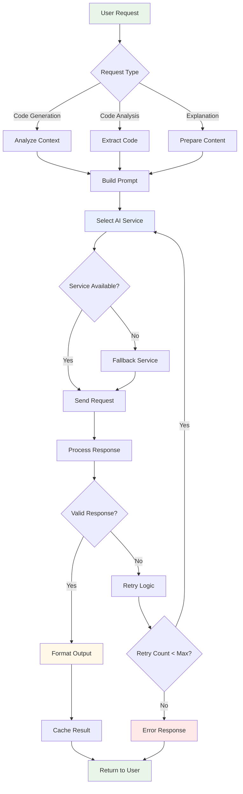

### 2.4 Content Analysis Engine

#### 2.4.1 Web Content Detection
```typescript
class ContentAnalyzer {
  detectCodeBlocks(): CodeBlock[];
  identifyFrameworks(): Framework[];
  extractAPIs(): APIEndpoint[];
  analyzePageStructure(): PageStructure;
  findInputFields(): InputField[];
  detectInteractiveElements(): InteractiveElement[];
}

interface CodeBlock {
  language: string;
  content: string;
  location: DOMLocation;
  context: string;
}
```

#### 2.4.2 Context Extraction
- **Code Snippets**: Automatic detection and parsing
- **Documentation**: API docs, tutorials, examples
- **Form Fields**: Input validation and generation
- **Interactive Elements**: Buttons, links, components
- **Page Metadata**: Title, description, keywords

#### 2.4.3 Content Analysis Data Flow

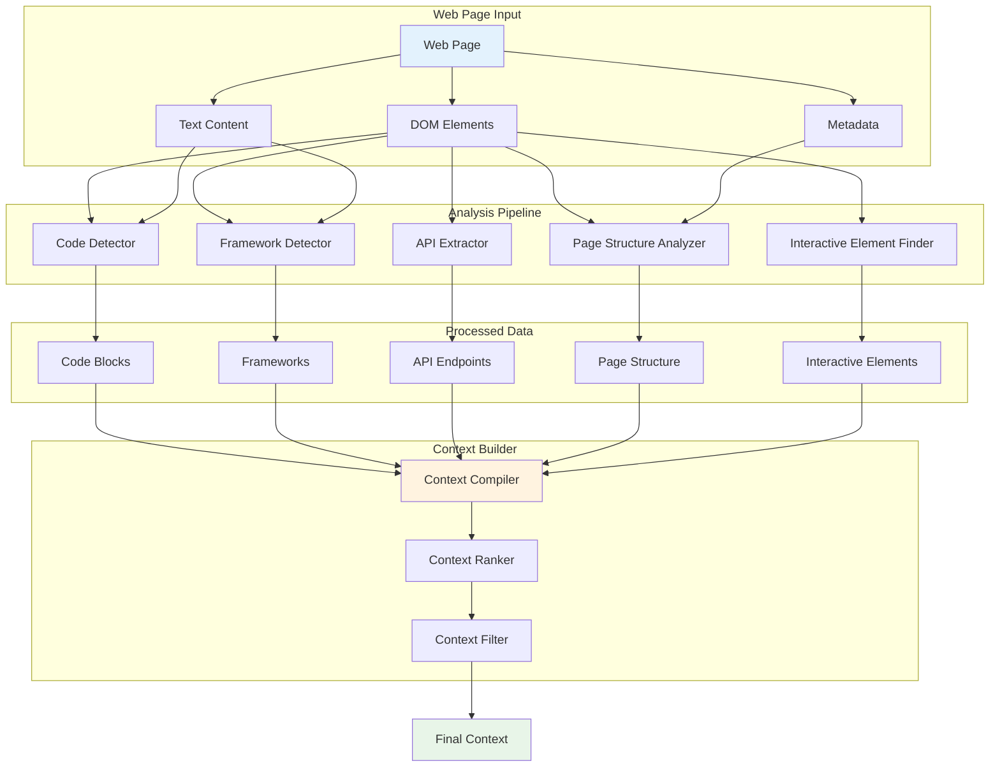

### 2.5 Code Generation & Manipulation Engine

#### 2.5.1 Generation Pipeline
```typescript
class CodeGenerator {
  async generateFromPrompt(prompt: string, context: GenerationContext): Promise<CodeResult> {
    const analyzedContext = await this.analyzeContext(context);
    const aiResponse = await this.aiService.generate(prompt, analyzedContext);
    const processedCode = await this.processGeneration(aiResponse);
    return this.validateAndFormat(processedCode);
  }
  
  async refactorCode(code: string, instructions: string): Promise<RefactorResult>;
  async explainCode(code: string): Promise<ExplanationResult>;
  async convertCode(code: string, targetLanguage: string): Promise<ConversionResult>;
}
```

#### 2.5.2 Code Manipulation Features
- **Syntax Highlighting**: Multi-language support
- **Auto-completion**: Context-aware suggestions
- **Error Detection**: Real-time validation
- **Format Conversion**: Between different formats/languages
- **Template Generation**: Boilerplate code creation

### 2.6 Session Management System

#### 2.6.1 Session State
```typescript
interface SessionState {
  id: string;
  userId: string;
  projectContext: ProjectContext;
  aiConversation: ConversationHistory;
  activeFiles: FileReference[];
  preferences: UserPreferences;
  timestamp: number;
}

interface ProjectContext {
  name: string;
  framework: string;
  language: string;
  dependencies: Dependency[];
  structure: ProjectStructure;
}
```

#### 2.6.2 Persistence Strategy
- **Local Storage**: Session data, preferences
- **IndexedDB**: Large data, file contents
- **Cloud Sync**: Optional cloud synchronization
- **VS Code Sync**: Bidirectional state synchronization

## 3. Integration Architecture

### 3.1 VS Code Integration Points

#### 3.1.1 Extension Communication
```typescript
// VS Code Extension Bridge
class VSCodeBridge {
  async sendCommand(command: string, args: any[]): Promise<any>;
  async getWorkspaceInfo(): Promise<WorkspaceInfo>;
  async getActiveFile(): Promise<FileInfo>;
  async executeVSCodeCommand(command: string): Promise<any>;
  
  // Event listeners
  onFileChange(callback: (file: FileInfo) => void): void;
  onProjectChange(callback: (project: ProjectInfo) => void): void;
  onAIResponse(callback: (response: AIResponse) => void): void;
}
```

#### 3.1.2 AiDE Agent Integration
- **Command Forwarding**: Relay commands to AiDE Agent
- **Context Sharing**: Share web context with VS Code
- **File Synchronization**: Sync file changes
- **AI Model Sharing**: Use same AI configuration

### 3.2 Browser Integration Points

#### 3.2.1 DOM Interaction
```typescript
class DOMController {
  injectInterface(location: string): void;
  highlightElements(elements: Element[]): void;
  extractContent(selector: string): string;
  insertCode(code: string, location: InsertLocation): void;
  createFloatingPanel(): FloatingPanel;
}
```

#### 3.2.2 Page Enhancement
- **Code Highlighting**: Syntax highlighting injection
- **Interactive Widgets**: AI assistance widgets
- **Context Menus**: Right-click AI actions
- **Overlay Interfaces**: Non-intrusive UI elements

## 4. User Interface Architecture

### 4.1 Interface Components

#### 4.1.1 Primary Interfaces
1. **Browser Action Popup**: Quick access panel
2. **Sidebar Panel**: Detailed interaction interface
3. **Floating Widgets**: Context-sensitive tools
4. **Inline Overlays**: Code enhancement overlays
5. **Context Menus**: Right-click actions

#### 4.1.2 UI Component Structure
```typescript
interface UIComponent {
  id: string;
  type: ComponentType;
  position: Position;
  visibility: VisibilityRule[];
  interactions: Interaction[];
  
  render(): HTMLElement;
  update(data: any): void;
  destroy(): void;
}

enum ComponentType {
  POPUP = 'popup',
  SIDEBAR = 'sidebar',
  FLOATING = 'floating',
  INLINE = 'inline',
  CONTEXT_MENU = 'context_menu'
}
```

### 4.2 User Experience Flow

#### 4.2.1 Primary User Journeys
1. **Code Analysis Journey**
   - User selects code on webpage
   - Plugin analyzes and provides insights
   - AI suggestions displayed in context

2. **Code Generation Journey**
   - User describes requirements
   - AI generates code with VS Code context
   - Code preview and integration options

3. **Learning Journey**
   - User requests explanation of code
   - AI provides detailed explanation
   - Links to related documentation/tutorials

#### 4.2.2 User Journey Flow Diagram

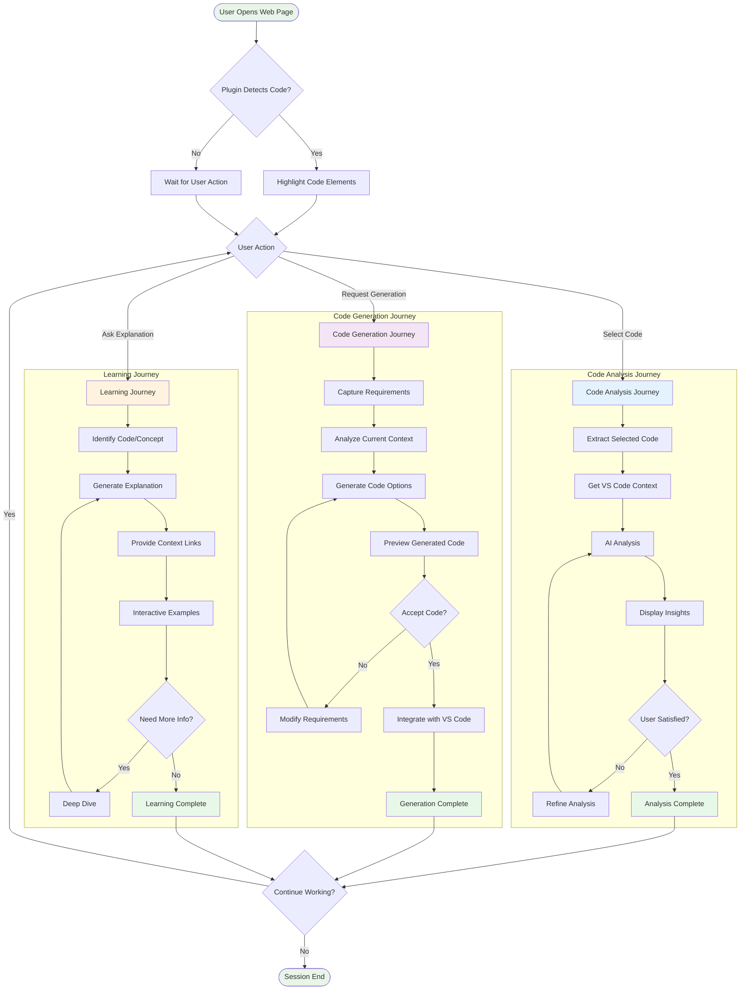

## 5. Security Architecture

### 5.1 Security Layers

#### 5.1.1 Security Architecture Diagram

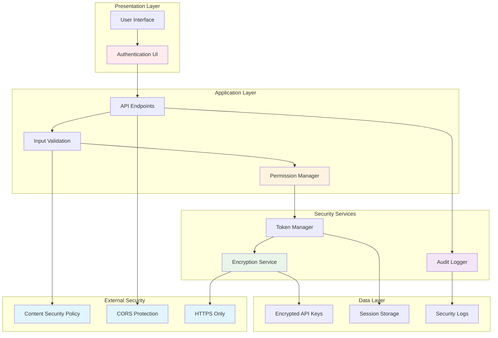

#### 5.1.2 Authentication & Authorization
```typescript
interface SecurityManager {
  authenticateUser(): Promise<AuthResult>;
  validateAPIKey(service: string, key: string): Promise<boolean>;
  encryptSensitiveData(data: any): string;
  decryptSensitiveData(encrypted: string): any;
  validatePermissions(action: string): boolean;
}
```

#### 5.1.2 Security Measures
- **API Key Encryption**: Secure storage of AI service keys
- **Content Sanitization**: XSS prevention
- **Permission Management**: Granular access control
- **Secure Communication**: Encrypted data transmission
- **Privacy Protection**: No unauthorized data collection

### 5.2 Data Privacy

#### 5.2.1 Data Handling
- **Local Processing**: Minimize data transmission
- **Consent Management**: User consent for data usage
- **Data Retention**: Configurable retention policies
- **Anonymization**: Remove personally identifiable information

## 6. Performance & Scalability

### 6.1 Performance Optimization

#### 6.1.1 Loading Strategies
- **Lazy Loading**: Load components on demand
- **Code Splitting**: Separate bundles for different features
- **Caching**: Intelligent caching of AI responses
- **Debouncing**: Optimize frequent operations

#### 6.1.2 Resource Management
```typescript
class ResourceManager {
  async loadModule(module: string): Promise<any>;
  cacheResponse(key: string, response: any, ttl: number): void;
  invalidateCache(pattern: string): void;
  optimizeMemoryUsage(): void;
  throttleRequests(endpoint: string, limit: number): void;
}
```

### 6.2 Scalability Considerations

#### 6.2.1 Horizontal Scaling
- **Microservice Architecture**: Modular service design
- **Load Balancing**: Distribute AI service requests
- **Queue Management**: Handle high-volume requests
- **Rate Limiting**: Prevent service overload

## 7. Error Handling & Monitoring

### 7.1 Error Management

#### 7.1.1 Error Categories
```typescript
enum ErrorType {
  NETWORK_ERROR = 'network_error',
  AI_SERVICE_ERROR = 'ai_service_error',
  VSCODE_BRIDGE_ERROR = 'vscode_bridge_error',
  DOM_ACCESS_ERROR = 'dom_access_error',
  PERMISSION_ERROR = 'permission_error'
}

interface ErrorHandler {
  handleError(error: Error, type: ErrorType): void;
  reportError(error: Error, context: ErrorContext): void;
  recoverFromError(error: Error): Promise<boolean>;
}
```

#### 7.1.2 Recovery Strategies
- **Graceful Degradation**: Fallback functionality
- **Retry Logic**: Automatic retry with backoff
- **User Notification**: Clear error messages
- **Logging**: Comprehensive error logging

#### 7.1.3 Error Handling Flow

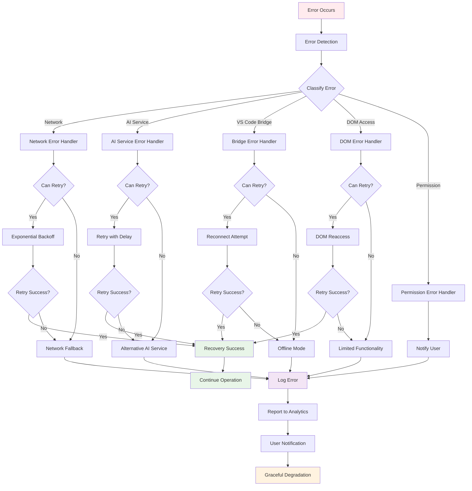

### 7.2 Monitoring & Analytics

#### 7.2.1 Metrics Collection
- **Usage Analytics**: Feature usage patterns
- **Performance Metrics**: Response times, error rates
- **User Feedback**: Satisfaction and improvement suggestions
- **System Health**: Resource usage, availability

## 8. Development & Deployment

### 8.1 Development Architecture

#### 8.1.1 Development Environment
```
development/
├── src/                    # Source code
├── tests/                  # Test suites
├── docs/                   # Documentation
├── scripts/                # Build and deploy scripts
├── config/                 # Configuration files
└── tools/                  # Development tools
```

#### 8.1.2 Build Pipeline
- **TypeScript Compilation**: Type-safe development
- **Bundle Optimization**: Webpack/Rollup bundling
- **Testing**: Unit, integration, and E2E tests
- **Linting**: Code quality enforcement
- **Documentation**: Automated documentation generation

#### 8.1.3 Development Workflow

```mermaid
gitgraph
    commit id: "Initial Setup"
    branch feature
    checkout feature
    commit id: "Feature Development"
    commit id: "Add Tests"
    commit id: "Code Review"
    checkout main
    merge feature
    commit id: "Build & Test"
    branch release
    checkout release
    commit id: "Version Bump"
    commit id: "Package Extension"
    commit id: "Store Submission"
    checkout main
    merge release
    commit id: "Deploy Complete"
```

#### 8.1.4 CI/CD Pipeline

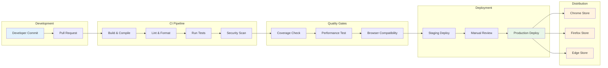

### 8.2 Deployment Strategy

#### 8.2.1 Distribution Channels
- **Chrome Web Store**: Primary distribution
- **Firefox Add-ons**: Firefox support
- **Edge Add-ons**: Microsoft Edge support
- **Enterprise Distribution**: Private distribution for organizations

#### 8.2.2 Update Mechanism
- **Automatic Updates**: Seamless update delivery
- **Versioning**: Semantic versioning strategy
- **Rollback**: Quick rollback capability
- **Feature Flags**: Gradual feature rollout

#### 8.2.3 Deployment Architecture

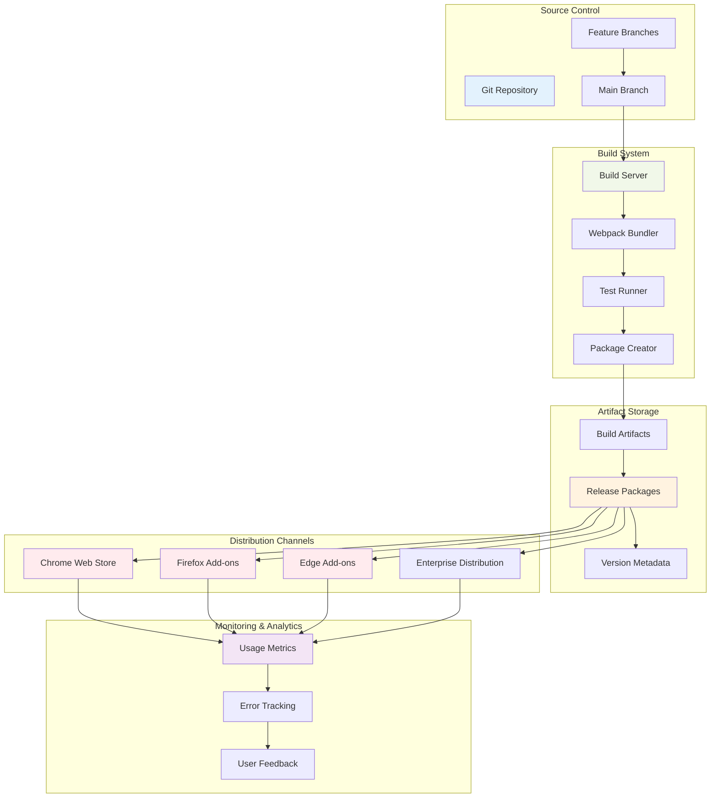

## 9. Configuration & Customization

### 9.1 Configuration Architecture

#### 9.1.1 Configuration Schema
```typescript
interface PluginConfiguration {
  aiService: AIServiceConfig;
  userInterface: UIConfig;
  integration: IntegrationConfig;
  security: SecurityConfig;
  performance: PerformanceConfig;
}

interface AIServiceConfig {
  primaryService: string;
  fallbackServices: string[];
  modelPreferences: ModelConfig[];
  rateLimits: RateLimit[];
}
```

### 9.2 Customization Options

#### 9.2.1 User Customization
- **UI Themes**: Light/dark mode, custom themes
- **Keyboard Shortcuts**: Customizable key bindings
- **Feature Toggles**: Enable/disable specific features
- **AI Preferences**: Model selection, prompt customization
- **Integration Settings**: VS Code connection configuration

## 10. Future Extensibility

### 10.1 Plugin Architecture

#### 10.1.1 Extension Points
```typescript
interface PluginAPI {
  registerContentAnalyzer(analyzer: ContentAnalyzer): void;
  registerCodeGenerator(generator: CodeGenerator): void;
  registerUIComponent(component: UIComponent): void;
  registerAIService(service: AIService): void;
}
```

#### 10.1.2 Plugin Extension Architecture

```mermaid
graph TB
    subgraph "Core Plugin"
        CORE[AiDE Web Plugin Core]
        API[Plugin API]
        REGISTRY[Extension Registry]
    end
    
    subgraph "Content Analyzers"
        CA1[JavaScript Analyzer]
        CA2[Python Analyzer]
        CA3[React Analyzer]
        CA4[Custom Analyzer]
    end
    
    subgraph "Code Generators"
        CG1[Template Generator]
        CG2[Boilerplate Generator]
        CG3[Test Generator]
        CG4[Custom Generator]
    end
    
    subgraph "UI Components"
        UI1[Custom Popup]
        UI2[Sidebar Panel]
        UI3[Floating Widget]
        UI4[Context Menu]
    end
    
    subgraph "AI Services"
        AI1[OpenAI Integration]
        AI2[Claude Integration]
        AI3[Local LLM]
        AI4[Custom AI API]
    end
    
    subgraph "Third-party Extensions"
        EXT1[GitHub Integration]
        EXT2[Stack Overflow]
        EXT3[Documentation]
        EXT4[Custom Tools]
    end
    
    CORE --> API
    API --> REGISTRY
    
    CA1 --> REGISTRY
    CA2 --> REGISTRY
    CA3 --> REGISTRY
    CA4 --> REGISTRY
    
    CG1 --> REGISTRY
    CG2 --> REGISTRY
    CG3 --> REGISTRY
    CG4 --> REGISTRY
    
    UI1 --> REGISTRY
    UI2 --> REGISTRY
    UI3 --> REGISTRY
    UI4 --> REGISTRY
    
    AI1 --> REGISTRY
    AI2 --> REGISTRY
    AI3 --> REGISTRY
    AI4 --> REGISTRY
    
    EXT1 --> API
    EXT2 --> API
    EXT3 --> API
    EXT4 --> API
    
    style CORE fill:#e3f2fd
    style API fill:#f1f8e9
    style REGISTRY fill:#fff3e0
    style CA1 fill:#e8f5e8
    style CA2 fill:#e8f5e8
    style CA3 fill:#e8f5e8
    style CA4 fill:#e8f5e8
    style CG1 fill:#f3e5f5
    style CG2 fill:#f3e5f5
    style CG3 fill:#f3e5f5
    style CG4 fill:#f3e5f5
    style UI1 fill:#fce4ec
    style UI2 fill:#fce4ec
    style UI3 fill:#fce4ec
    style UI4 fill:#fce4ec
    style AI1 fill:#ffebee
    style AI2 fill:#ffebee
    style AI3 fill:#ffebee
    style AI4 fill:#ffebee
```

### 10.2 Roadmap Considerations

#### 10.2.1 Planned Extensions
- **Multi-IDE Support**: IntelliJ, Sublime Text integration
- **Mobile Browser Support**: Mobile web browsers
- **Collaborative Features**: Team collaboration tools
- **Advanced AI Features**: Multi-modal AI, voice interaction
- **Enterprise Features**: SSO, advanced security, analytics

## 11. Technical Specifications

### 11.1 Technology Stack

#### 11.1.1 Core Technologies
- **Frontend**: TypeScript, React/Vue.js, Tailwind CSS
- **Build Tools**: Webpack, Babel, ESLint, Prettier
- **Testing**: Jest, Cypress, Testing Library
- **Communication**: WebRTC, WebSocket, Native Messaging
- **Storage**: IndexedDB, Local Storage, Chrome Storage API

#### 11.1.2 External Dependencies
- **AI Services**: OpenAI API, Anthropic API
- **VS Code Extensions**: VS Code Extension API
- **Browser APIs**: Extension APIs, DOM APIs
- **Security**: Crypto APIs, Security libraries

### 11.2 System Requirements

#### 11.2.1 Minimum Requirements
- **Browser**: Chrome 88+, Firefox 78+, Edge 88+
- **VS Code**: Version 1.60+
- **Memory**: 256MB available RAM
- **Network**: Stable internet connection for AI services

## 12. Risk Analysis & Mitigation

### 12.1 Technical Risks

#### 12.1.1 Risk Matrix
| Risk | Probability | Impact | Mitigation |
|------|------------|--------|------------|
| AI Service Downtime | Medium | High | Fallback services, local caching |
| Browser Compatibility | Low | Medium | Comprehensive testing, polyfills |
| VS Code Integration Failure | Medium | High | Robust error handling, fallback modes |
| Performance Issues | Medium | Medium | Performance monitoring, optimization |

### 12.2 Business Risks

#### 12.2.1 Market Risks
- **Competition**: Existing AI coding tools
- **User Adoption**: Learning curve for new users
- **Technology Changes**: Rapid AI/browser evolution
- **Regulatory**: AI usage regulations

## Conclusion

This architecture provides a solid foundation for Phase 1 of the AiDE Agent Web Plugin development. The modular design ensures scalability, maintainability, and extensibility while addressing security, performance, and user experience concerns. The architecture supports seamless integration between web browsers and VS Code environments, enabling powerful AI-assisted development workflows across different contexts.

### System Integration Overview

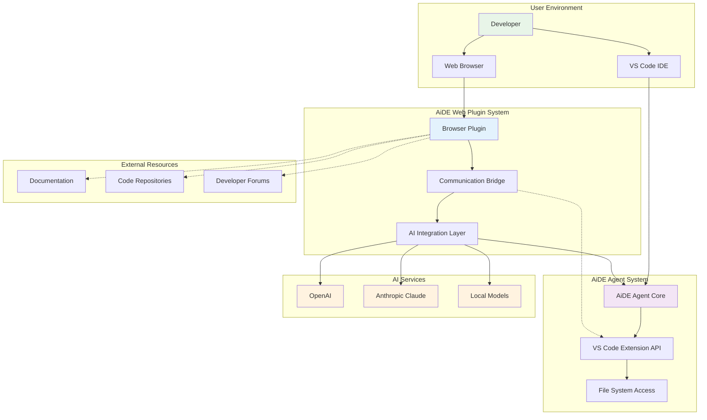

The next phase will focus on detailed implementation specifications, component development, and system integration based on this architectural foundation.